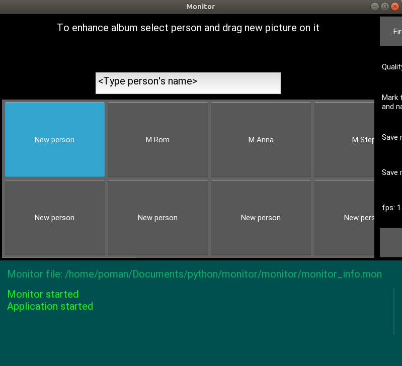
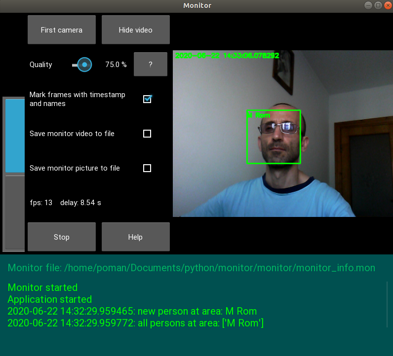

# Monitor
* Monitor area via vebcam

### Prerequisites
* python 3
* Kivy v1.11.1
* opencv v2 or v3 or v4
* face-recognition v1.3
* imutils (better the last version)
* at least one web-cam

### Run application
* to run application in terminal: python main.py

### Application preentscreens

### Links
* Who are interesting with computer vision I recommending this place: www.pyimagesearch.com

### Author
* MarsLviv - *matsars@gmail.com*
